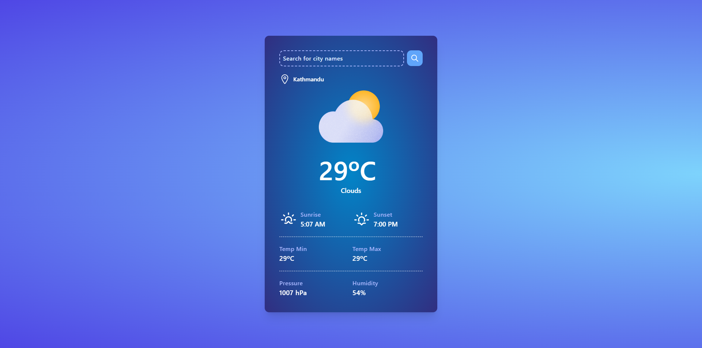

# Storm (Weather App) 

This is a weather application built with React that allows user to search for weather information based on city names. It fetches weather data from the OpenWeather API and displays the current temperature, weather condition, sunrise and sunset times, as well as other relevant information.



## Installation

To run the React Weather App locally, follow these steps:

1. Clone the repository:

   ```bash
   git clone https://github.com/npc-xss/storm-weather-app.git
   ```

2. Change into the project directory:

   ```bash
   cd storm-weather-app
   ```

3. Install the dependencies:

   ```bash
   npm install
   ```

4. Create a `.env` file in the root directory of the project and add your OpenWeather API key:

   ```plaintext
   REACT_APP_WEATHER_API_KEY=your-api-key
   ```

5. Start the development server:

   ```bash
   npm run dev
   ```

6. Open your browser and navigate to `http://localhost:5173` to see the app running.

## Usage

The React Weather App provides a user interface where you can search for weather information by entering the name of a city in the search input field. Pressing Enter or clicking the search button will trigger the weather data retrieval.

The app displays the current temperature in Celsius, the weather condition, and the current date and time. It also shows the city name, sunrise and sunset times, minimum and maximum temperatures, pressure, and humidity if available.

## License

This project is licensed under the MIT License. See the [LICENSE](LICENSE) file for more information.
